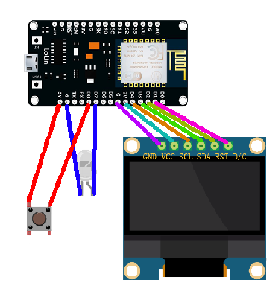
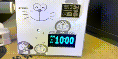

# BJUTClock
一款可以同步北工大时间的小钟，只要有bjut_wifi的地方就可以同步时间，不需要登录网关。使用ESP8266开发，包含一个led灯，一个OLED屏幕，一个轻触开关，具体的连接示意图如下： 
 
安装方法是将`source`文件夹里全部文件拷贝到开发板上即可。显示界面如下，12小时显示模型，包含周和日期： 
 
还有宠物功能，可以随着开启时间进化5个级别，按下开关就可以查看宠物。 
最终效果 
 